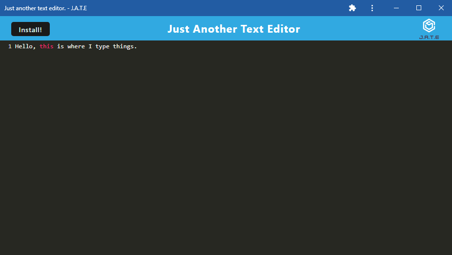

# Text-Editor

## Badge
[]
 

## Table of Contents
- [Description](#description)
- [Screenshots](#screenshots)
- [Usage](#usage)
- [What I Have Learned](#what-i-have-learned)
- [Credits](#credits)
- [Licenses](#licenses)
 

## Description
Challenge 19 coursework for UT bootcamp. Uses PWA structure, idb package for IndexedDB, and Heroku.  
This is a text editor that not only runs in-browser while online, but can be downloaded and used  
offline as well. It retrieves and stores data to an IndexedDB database, and features data  
persistence methods that can be relied on, in case the browser does not support certain options.  

## Screenshots
---Main page---  

 

---Checking manifest.json---  

 

 

---Checking JATE storage---  

 

---Downloaded app---  

 

---After entering text on app and opening website---  

 

## Usage
Simply click on the link and watch the magic happen.    
Link to the website: OFFLINE  

## What I Have Learned
I have learned how PWAs (Progressive Web Applications) function as a client/server setting.  
The server hosts the routes (back-end) while the client hosts the css, images, js files, as  
well as the main index.html, service worker, and webpack configuration (front-end) for the program.  
Being able to download the application and use it offline is extremely useful.  

## Credits
Made by Allie Stewart.  

## Licenses
Please refer to the LICENSE in the repository.  
